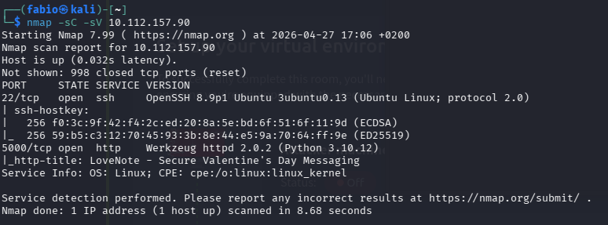
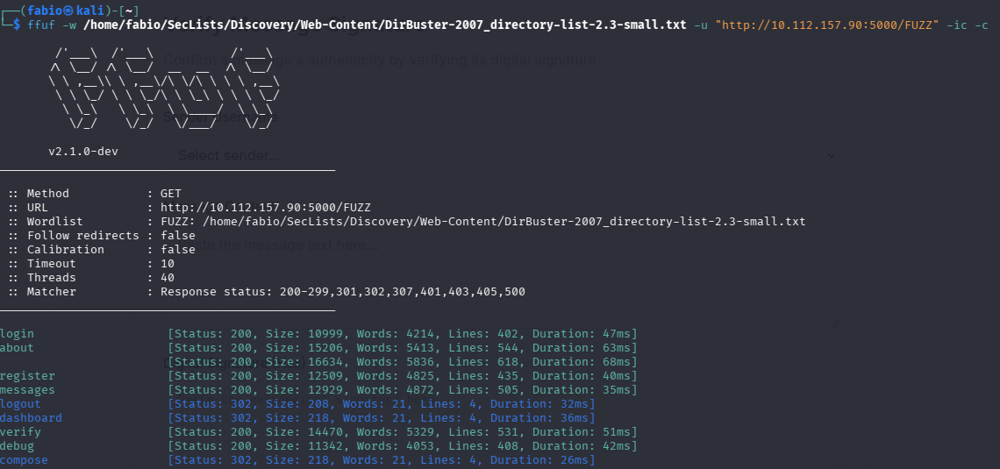
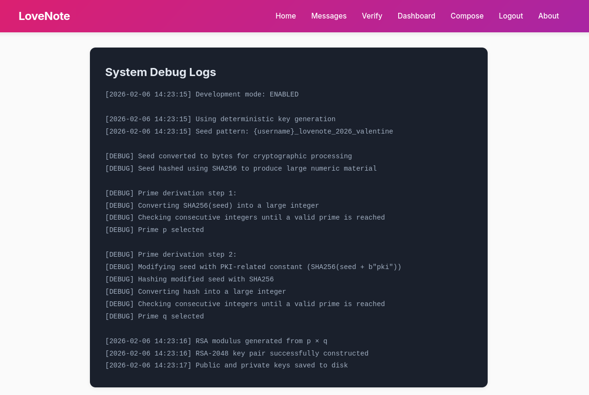
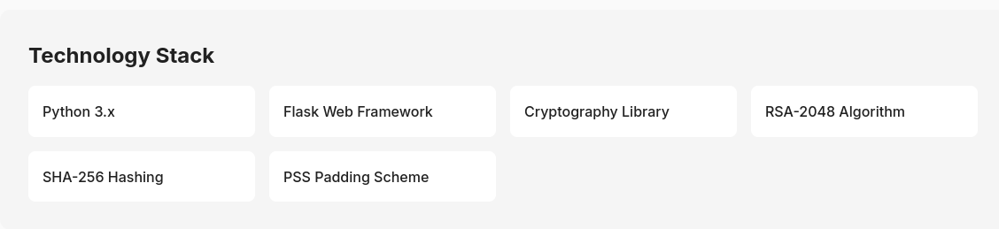
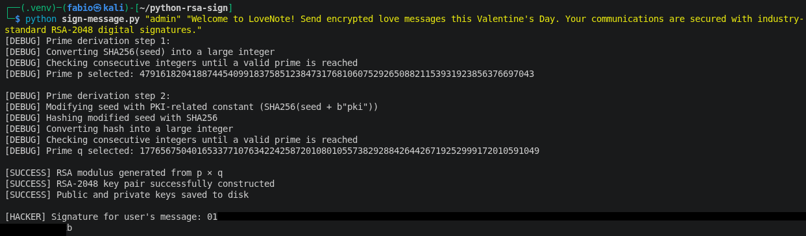
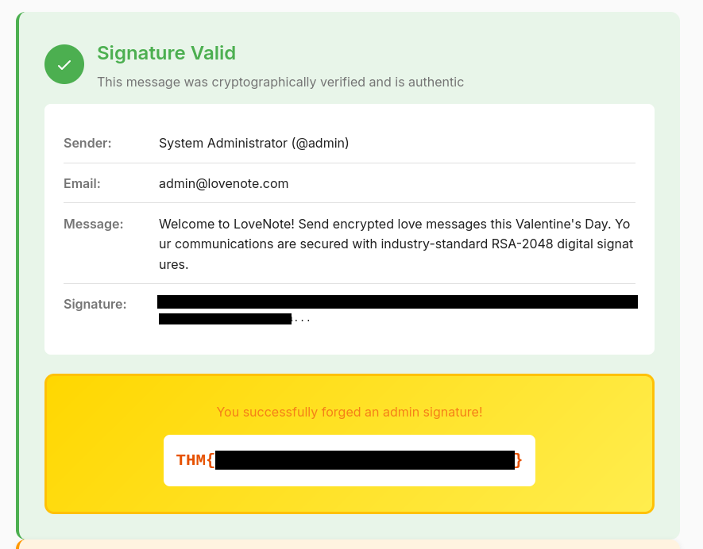

# Signed Messages Writeup by FabioLongo


> Can we break RSA encryption?

## Start

Let’s start with an `nmap` scan.

`nmap -sC -sV 10.112.157.90`

  

Only port 5000 is open, let's check it in the browser.

There are a service called LoveNote, where users can exchange messages. The service heavily emphasizes that every message is signed using ***RSA-2048 encryption*** - this is mentioned on nearly every page.


The attack vector becomes fairly obvious: if they’re constantly bragging about RSA, something is probably wrong with their implementation, and that’s likely what we can exploit. So we’ll focus exclusively in that direction.

Here’s the functionality we’ve identified:

- registration
- login (without password)
- sending private messages
- sending public messages
- **verifying** message’s RSA-2048 signature for a given author

When registering, the service generates an RSA-2048 key pair for us.

After inspecting all available requests through `Burp Suite`, nothing useful turned up. No signatures or public keys in headers, cookies, query parameters, or POST bodies. So we need to dig deeper.

Let’s try fuzzing the service endpoints using `ffuf` with a standard directory wordlist.



Bingo. Alongside the known endpoints, `ffuf` discovered a hidden one: `/debug`. Let’s check it out.

## RSA-2048 encryption

`/debug` page provides a very detailed explanation of the key generation process - and this becomes our main attack vector.



Let’s break it down.

How are RSA keys generated?
Two random prime numbers, `p` and `q`, are chosen, and their product n is computed. Then Euler’s totient function `φ(n)` is calculated.
A number `e` is selected - it must satisfy certain conditions, but in practice it’s almost always `65537`. Then we compute `d`, the modular inverse of e modulo `φ(n)`.

In the end:

- `(e, n)` is the public key
- `(d, n)` is the private key

You don’t need to fully understand the math here. The important part is that we now know exactly how `p` and `q` are generated - which means we can reproduce the key pairs of other users. The rest of the arithmetic can be handled by Python libraries.

Let’s reconstruct the generation process for `p` and `q`.

For `p`:

```python
import hashlib
from sympy import nextprime

seed = b"admin_lovenote_2026_valentine"
def prime_derivation_1(seed):

    print("[DEBUG] Prime derivation step 1:\n"+
          "[DEBUG] Converting SHA256(seed) into a large integer")
    
    seed_bytes = bytes(seed)
    seed_sha_hash = hashlib.sha256(seed_bytes)
    seed_large_integer = int.from_bytes(seed_sha_hash.digest(), byteorder="big")

    print("[DEBUG] Checking consecutive integers until a valid prime is reached")
    return nextprime(seed_large_integer)
```


For `q`:

```python
def prime_derivation_2(seed):

    print('\n[DEBUG] Prime derivation step 2:')
    print('[DEBUG] Modifying seed with PKI-related constant (SHA256(seed + b"pki"))')
    modified_seed = seed + b"pki"

    print('[DEBUG] Hashing modified seed with SHA256')
    modified_seed_hash = hashlib.sha256(modified_seed)

    print('[DEBUG] Converting hash into a large integer')
    seed_large_integer = int.from_bytes(modified_seed_hash.digest(), byteorder="big")

    print('[DEBUG] Checking consecutive integers until a valid prime is reached')
    return nextprime(seed_large_integer)
```

Now we’re ready to construct the private key. But first, let’s take a step back. If we carefully check the `/about` page, we can see the technology stack used.



What matters to us is that the service uses the `cryptography` library for key generation, along with the `PSS padding scheme`.

Let’s reconstruct the private key using the recovered `p` and `q`:

```python
from cryptography.hazmat.primitives.asymmetric.rsa import (
    RSAPrivateNumbers, RSAPublicNumbers, rsa_crt_iqmp, rsa_crt_dmp1, rsa_crt_dmq1
)

def create_private_key(p, q):
    n = p * q
    e = 65537
    d = pow(e, -1, (p - 1) * (q - 1))

    dp    = rsa_crt_dmp1(d, p)
    dq    = rsa_crt_dmq1(d, q)
    iqmp  = rsa_crt_iqmp(p, q)
    
    public_numbers = RSAPublicNumbers(e, n)
    private_numbers = RSAPrivateNumbers(p, q, d, dp, dq, iqmp, public_numbers)
    private_key = private_numbers.private_key()

    return private_key
```

Then, using this key, we sign any message as the admin.

It’s important to match the correct padding and salt lenght used by the backend - otherwise, the signature will be invalid.

```python
from cryptography.hazmat.primitives import hashes
from cryptography.hazmat.primitives.asymmetric import padding
rom cryptography.hazmat.primitives.asymmetric.rsa import (RSAPrivateNumbers, RSAPublicNumbers)

def sign_message(private_key, message):

    signature = private_key.sign(message,
                                 padding.PSS(
                                     mgf=padding.MGF1(hashes.SHA256()),
                                     salt_length=padding.PSS.MAX_LENGTH
                                 ),
                                 hashes.SHA256()
                                 ).hex()
    
    return signature
```


All that’s left is to put together a <a href = "./sign-message.py">script</a> and submit the generated signature on the `/verify` page.





***And there’s our flag.***

You can find the full script <a href = "./sign-message.py"> here</a>.
